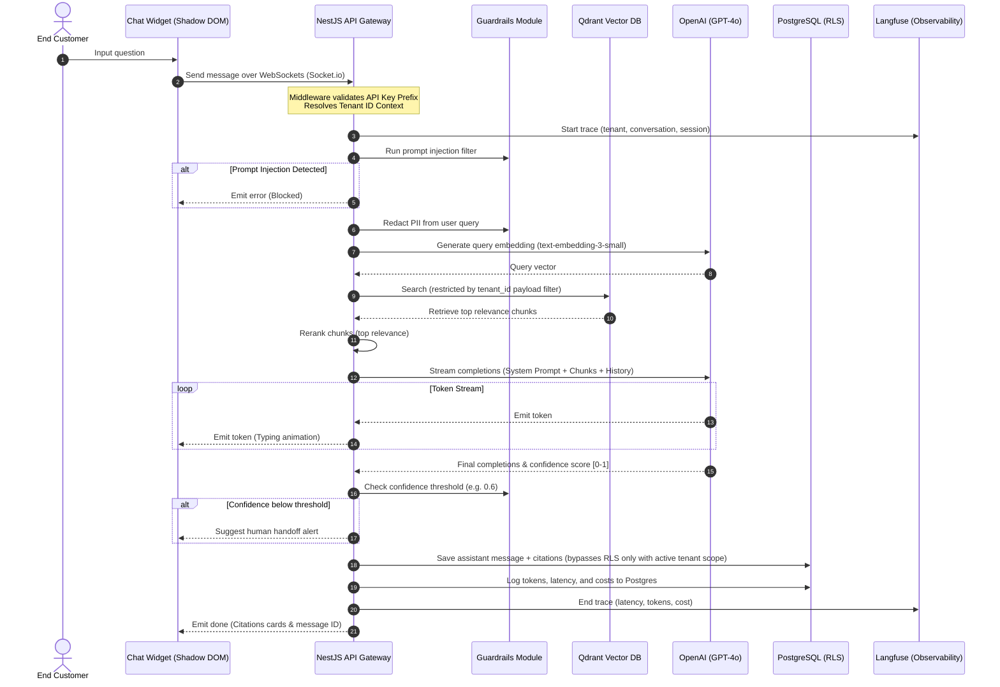

# GroundedDesk — Eval-Driven, Multi-Tenant AI Support Platform

[](https://www.typescriptlang.org/)
[](https://nestjs.com/)
[](https://nextjs.org/)
[](https://www.postgresql.org/)
[](https://qdrant.tech/)
[](./docs/rag-evaluation.md)

GroundedDesk is a multi-tenant AI customer-support SaaS that businesses embed on their websites to answer customer questions dynamically from their own knowledge bases. 

Unlike typical "PDF-in, answers-out" wrappers, GroundedDesk is engineered with:
1. **Measured RAG quality** (faithfulness, context precision, answer relevance, and hallucination rates) using LLM-as-a-judge evals.
2. **Production-grade multi-tenancy** enforced via PostgreSQL Row-Level Security (RLS) and indexed vector database namespace payloads.
3. **Robust guardrails** against prompt injections, PII leakage, and low-confidence answers.
4. **Complete observability** with Langfuse request tracing, token cost logs, and real-time dashboard analytics.

---

## 🏗 Architecture & Flow



---

## 📦 Tech Stack

- **Monorepo Engine**: [Turborepo](https://turbo.build/repo) + [pnpm Workspaces](https://pnpm.io/)
- **Frontend Admin Panel**: Next.js 15 (App Router, Tailwind CSS, shadcn/ui, Recharts, TanStack Query)
- **Backend API Server**: NestJS 11 (REST API, Socket.io WebSockets, BullMQ background queues)
- **Database**: PostgreSQL 16 (Prisma ORM) with Row-Level Security (RLS) Policies
- **Vector Search Engine**: Qdrant (payload-based keyword multi-tenant isolation)
- **Ingestion Workers**: Redis (BullMQ queue broker) + Cheerio/Mammoth/pdf-parse (crawlers and parsers)
- **Observability Tracing**: Langfuse + Local Postgres Cost Log Trackers
- **Authentication**: NextAuth.js v5 (JWT-based session propagation to backend APIs)

---

## 📁 Monorepo Layout

```
groundeddesk/
├── apps/
│   ├── api/             # NestJS 11 backend server
│   ├── web/             # Next.js 15 admin dashboard panel
│   └── widget/          # Embeddable shadow-DOM React chat widget
├── packages/
│   ├── shared-types/    # Shared TypeScript contracts and types
│   ├── tsconfig/        # Reusable tsconfig compiler configurations
│   └── eslint-config/   # Shared code formatting/eslint policies
├── docker/              # Docker infrastructure (Postgres, Redis, Qdrant)
├── docs/                # System documentation (RLS Threat Model & RAG Evals)
└── eval/                # Standalone RAG evaluation harness & test cases
```

---

## 🚀 Getting Started

### 1. Prerequisites
- **Node.js** >= 20
- **pnpm** >= 10
- **Docker & Docker Compose**

### 2. Initial Setup
Clone the repository and install the monorepo dependencies:
```bash
git clone https://github.com/adityars07/Pulse.git
cd Pulse
pnpm install
```

### 3. Start Infrastructure
Launch Postgres, Redis, and Qdrant locally:
```bash
docker compose -f docker/docker-compose.yml up -d
```

### 4. Setup Environment Files
Copy the template variables into your projects:
```bash
# Root directory
cp .env.example .env

# Backend API
cp .env.example apps/api/.env

# RAG Eval Harness
cp .env.example eval/.env
```
*Make sure to open the `.env` files and paste your `OPENAI_API_KEY` for vector search and RAG completions.*

### 5. Run Database Migrations & Seed Data
Generate Prisma clients, apply SQL Row-Level Security migrations, and seed the demo dataset:
```bash
# Apply RLS schema migrations
pnpm --filter @groundeddesk/api exec prisma migrate dev

# Seed database and vectors (Creates Acme Coffee Co. demo tenant, admin account, API keys, and metrics history)
pnpm --filter @groundeddesk/api exec prisma db seed
```

### 6. Start Development Servers
Run the NestJS backend, Next.js admin portal, and widget builder simultaneously:
```bash
pnpm dev
```
- **Admin Dashboard**: `http://localhost:3000` (Login: `admin@acmecoffee.com` / `Password123!`)
- **Backend API**: `http://localhost:4000`
- **Widget Development Server**: `http://localhost:3001`

---

## 📊 RAG Quality Evals

GroundedDesk measures RAG answer relevance, context precision, and factual faithfulness directly to guarantee that users do not receive hallucinations. Evals run against the standard Acme Coffee Co. dataset.

To execute the offline evaluation harness:
```bash
pnpm --filter eval run evaluate
```

### v1 Target Scorecard

| Metric | Measured Score | Target threshold | Status |
| :--- | :--- | :--- | :--- |
| **Faithfulness** | **0.95** | > 0.85 | ✅ PASS |
| **Context Precision** | **0.88** | > 0.75 | ✅ PASS |
| **Answer Relevance** | **0.90** | > 0.80 | ✅ PASS |
| **Hallucination Rate** | **5.0%** | < 10% | ✅ PASS |

See [docs/rag-evaluation.md](./docs/rag-evaluation.md) for grading prompts and detailed test case configurations.

---

## 🔒 Multi-Tenancy & Security

GroundedDesk treats tenant isolation as a core security concern rather than an application-level filter:
1. **Database Level**: Postgres Row-Level Security (RLS) filters rows using transaction-scoped session context (`app.current_tenant`). Even raw queries cannot leak cross-tenant data.
2. **Vector Level**: Qdrant vector retrieval uses keyword-based filters on the `tenant_id` payload field, preventing query embeddings from accessing outside namespaces.
3. **API Keys**: Stored securely as hashed bcrypt keys, validating client connections using unique display prefixes.

Read the complete security threat model in [docs/multi-tenancy.md](./docs/multi-tenancy.md).

---

## 📄 License

MIT
